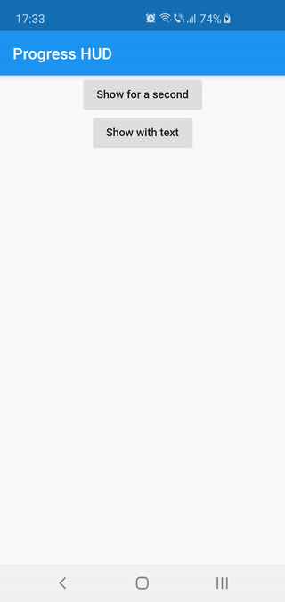

[](https://pub.dartlang.org/packages/flutter_progress_hud)

# Flutter Progress HUD

Highly customizable modal progress indicator with fade animation.

# Preview


# Usage
Wrap with `ProgressHUD` the widget on top of which you want to show the modal indicator.
```dart
ProgressHUD(
  child: HomePage(),
)
```
Get a reference of `ProgressHUD`
```dart
final progress = ProgressHUD.of(context);
```
Show indeterminate progress
```dart
progress.show();
```
Or a progress with text
```dart
progress.showWithText('Loading...');
```
Then dismiss
```dart
progress.dismiss();
```

## Example ([full](https://github.com/FlorinMihalache/flutter_progress_hud/blob/master/example/lib/main.dart))
```dart
ProgressHUD(
        child: Builder(
          builder: (context) => Center(
                child: Column(
                  children: <Widget>[
                    RaisedButton(
                      child: Text('Show for a second'),
                      onPressed: () {
                        final progress = ProgressHUD.of(context);
                        progress.show();
                        Future.delayed(Duration(seconds: 1), () {
                          progress.dismiss();
                        });
                      },
                    ),
                    RaisedButton(
                      child: Text('Show with text'),
                      onPressed: () {
                        final progress = ProgressHUD.of(context);
                        progress.showWithText('Loading...');
                        Future.delayed(Duration(seconds: 1), () {
                          progress.dismiss();
                        });
                      },
                    ),
                  ],
                ),
              ),
        ),
      ),
```

# Customization
<table>
    <th>Attribute Name</th>
    <th>Default Value</th>
    <th>Description</th>
    <tr>
        <td>indicatorColor</td>
        <td>Colors.white</td>
        <td>When using the default indicator widget, this is how you set its color</td>
    </tr>
    <tr>
        <td>indicatorWidget</td>
        <td>A basic CircularProgressIndicator</td>
        <td>Custom indicator widget</td>
    </tr>
    <tr>
        <td>backgroundColor</td>
        <td>Colors.black54</td>
        <td>Indicator background color</td>
    </tr>
    <tr>
        <td>backgroundRadius</td>
        <td>Radius.circular(8.0)</td>
        <td>Indicator background radius</td>
    </tr>
    <tr>
        <td>borderColor</td>
        <td>Colors.white</td>
        <td>Indicator background border color</td>
    </tr>
    <tr>
        <td>borderWidth</td>
        <td>0.0</td>
        <td>Indicator background border width</td>
    </tr>        
    <tr>
        <td>barrierEnabled</td>
        <td>true</td>
        <td>You can disable the modal barrier if you want to allow touches while the progress is shown</td>
    </tr>
    <tr>
        <td>barrierColor</td>
        <td>Colors.black12</td>
        <td>Color of the Barrier displayed behind the indicator</td>
    </tr>
    <tr>
        <td>textStyle</td>
        <td>TextStyle(color: Colors.white, fontSize: 14.0)</td>
        <td>TextStyle for the Text displayed below the indicator</td>
    </tr>
    <tr>
        <td>padding</td>
        <td>EdgeInsets.all(16.0)}</td>
        <td>Indicator content padding</td>
    </tr>
</table>